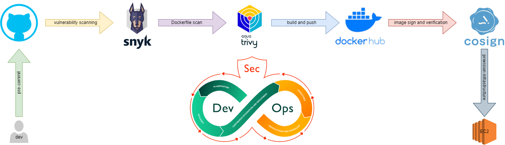
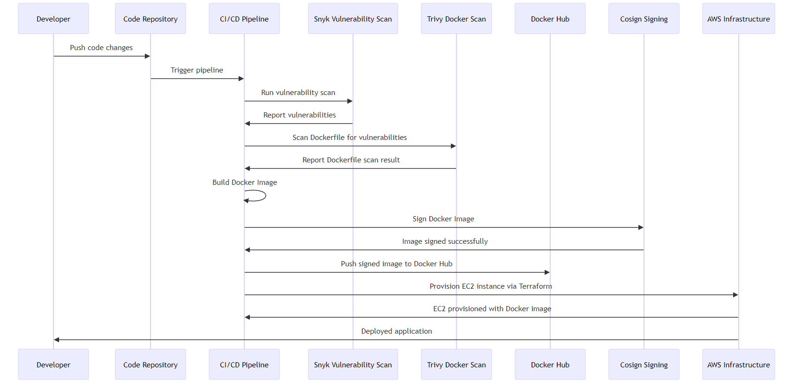

# CI/CD Pipeline for Java and Docker Project with DevSecOps

This repository contains a CI/CD pipeline designed for a Java-based application with a `pom.xml` file. The pipeline ensures code quality and security by integrating multiple DevSecOps practices, including Snyk vulnerability scanning, Trivy Dockerfile scanning, Docker image building, signing with Cosign, and infrastructure provisioning using Terraform on AWS.

<p align="center">
  
</p>

## Features

- **Snyk Vulnerability Scanning**: Detect security vulnerabilities in dependencies using Snyk.
- **Trivy Dockerfile Scanning**: Scan the Docker configuration for vulnerabilities.
- **Automated Versioning**: Automatically update versioning based on the branch being committed.
- **Docker Image Building**: Build Docker images and push them to Docker Hub.
- **Docker Image Signing**: Sign and verify Docker images with Cosign for security.
- **Infrastructure Provisioning**: Provision an EC2 instance on AWS using Terraform.

## Prerequisites

- **Snyk Token**: For scanning vulnerabilities, you must have a Snyk account and obtain an API token.
- **Docker Hub Credentials**: Required for pushing Docker images to Docker Hub.
- **Cosign Keys**: Used for signing Docker images for security.
- **AWS Credentials**: Required for provisioning infrastructure on AWS using Terraform.

## Flow

In this CI/CD pipeline flow, when a developer pushes code changes to the code repository, the pipeline is triggered. The pipeline first runs a vulnerability scan using Snyk, followed by a Dockerfile security scan using Trivy. Once the scans pass, the pipeline builds a Docker image and pushes it to Docker Hub. The Docker image is then signed using Cosign to ensure its integrity and authenticity. After successful signing and verification, an EC2 instance is provisioned via Terraform, which pulls the signed Docker image from Docker Hub to deploy the application, completing the end-to-end deployment process.

<p align="center">
  
</p>

## Pipeline Overview

This project uses GitHub Actions to automate the CI/CD process. The pipeline is triggered on every push to the `master` branch. It is divided into the following jobs:

### 1. Snyk Vulnerability Scanning

This job checks the project for security vulnerabilities in its dependencies using Snyk.

- **Install Snyk CLI**: The pipeline installs the Snyk CLI tool via npm.
- **Run Vulnerability Scan**: The `snyk test` command checks for critical vulnerabilities.
- **Monitor Project**: Snyk monitors the project for future vulnerability reports.

```yaml
name: snyk-scan
steps:
  - name: Install Snyk CLI
    run: npm install -g snyk
  - name: Run Snyk to check for vulnerabilities
    run: snyk test --file=pom.xml --severity-threshold=critical
```

### 2. Dockerfile Scan with Trivy

The Dockerfile is scanned for security vulnerabilities using Trivy, ensuring that your container configurations are secure.

- **Install Trivy**: Trivy is installed and configured to scan for vulnerabilities.
- **Run Scan**: Trivy performs a security scan, focusing on high and critical vulnerabilities.

```yaml
name: dockerfile-scan
steps:
  - name: Install Trivy
    run: |
      sudo apt-get install -y trivy
  - name: Scan Dockerfile
    run: trivy config --exit-code 1 --severity HIGH,CRITICAL .
```

### 3. Build and Deploy Docker Image

This job builds the Docker image for the Java application, automatically updates the version, pushes the image to Docker Hub, and signs it using Cosign.

- **Version Management**: The pipeline automatically updates the version based on the branch name.
- **Build Docker Image**: Builds the Docker image for the Java application.
- **Push to Docker Hub**: Pushes the built image to Docker Hub.
- **Sign Docker Image**: Uses Cosign to sign the image for verification.
- **Verify Image**: Ensures that the pushed Docker image is correctly signed.

```yaml
name: build-and-deploy
steps:
  - name: Build and Push Docker Image
    run: docker build -t <repo>:<tag> .
  - name: Sign Docker Image
    run: cosign sign -y --key cosign.key <image-digest>
  - name: Verify Docker Image
    run: cosign verify --key cosign.pub <image-digest>
```

### 4. Provision EC2 with Terraform

This job provisions an EC2 instance on AWS using Terraform, making it easy to deploy your application to the cloud.

- **AWS Credentials Configuration**: AWS credentials are configured via GitHub Secrets.
- **Terraform Setup**: Initializes Terraform and applies the infrastructure changes.
  
```yaml
name: provision-ec2
steps:
  - name: Terraform Apply
    run: |
      terraform init
      terraform apply -auto-approve
```

## How to Use

1. **Fork/Clone the Repository**: Clone this repository to your local machine.
2. **Configure Secrets**: Set up the necessary secrets in your GitHub repository:
   - `SNYK_TOKEN`: Your Snyk API token.
   - `DOCKERHUB_USERNAME`: Your Docker Hub username.
   - `DOCKERHUB_TOKEN`: Your Docker Hub token.
   - `COSIGN_PRIVATE_KEY`: Cosign private key for signing Docker images.
   - `COSIGN_PUBLIC_KEY`: Cosign public key for verifying Docker images.
   - `TF_USER_AWS_KEY`: AWS access key for Terraform.
   - `TF_USER_AWS_SECRET`: AWS secret access key for Terraform.
3. **Push Code**: The pipeline will automatically trigger on each push to the `master` branch.

## DevSecOps Practices

This pipeline follows key DevSecOps principles, ensuring security at every stage:

1. **Snyk Scans**: Detect vulnerabilities in dependencies.
2. **Trivy Scans**: Ensure the Docker configuration is secure.
3. **Docker Image Signing**: Adds an extra layer of security by signing Docker images with Cosign.
4. **Continuous Monitoring**: Monitors the project with Snyk for ongoing vulnerability management.

## Conclusion

This pipeline implements CI/CD with a strong focus on security, leveraging the power of DevSecOps. It automates everything from vulnerability scanning to Docker image signing and cloud provisioning.


## Authors

- [@StrukovSergei](https://github.com/StrukovSergei)
